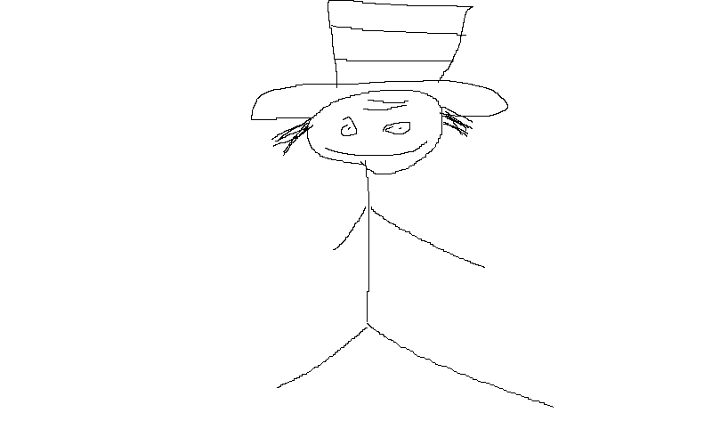

# 🎨 Drawspace

Drawspace is a lightweight drawing tool built using C++ and SDL2. It allows you to draw on a resizable canvas, switch colors, clear the canvas, and export your drawing as a PNG image.

## ✨ Features

- 🖌️ Draw with black, red, green, or blue
- 🧹 Clear the canvas
- 💾 Save your drawing as a PNG
- 🖥️ Resizable window with canvas scaling
- 🧱 Simple toolbar UI using SDL rectangles

## 🛠️ Built With

- [SDL2](https://www.libsdl.org/)
- [SDL_image](https://github.com/libsdl-org/SDL_image)
- [SDL_ttf](https://github.com/libsdl-org/SDL_ttf)
- C++

## 🖼️ Screenshot

